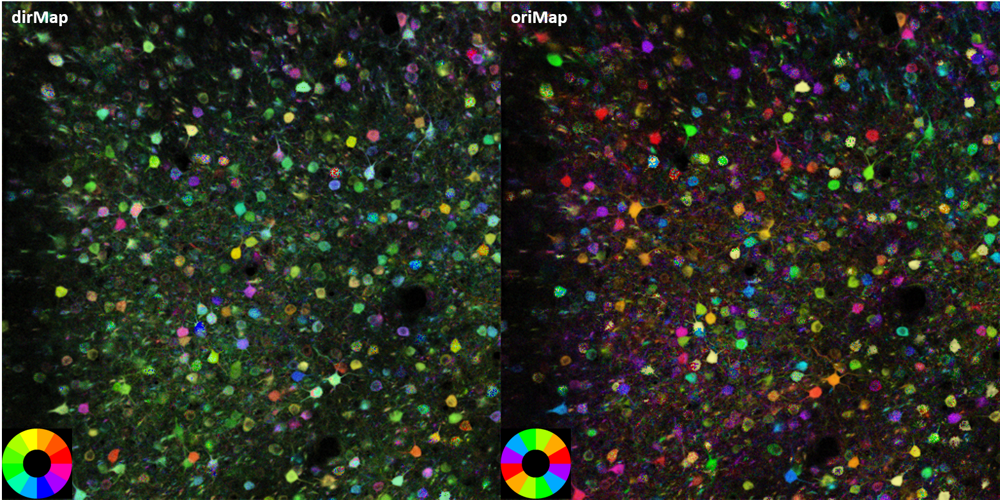
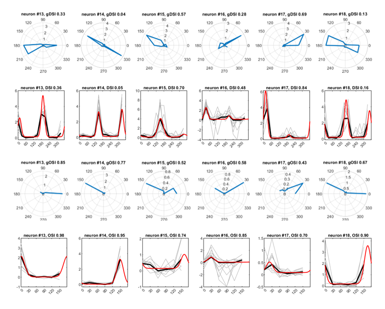

# dsMap: direction/orientation selectivity mapping

this package includes MATLAB functions to analysis direction/orientation selectivity from wide-field and two-photon calcium imaging data, recorded in classic experiments during which stimuli with specific directions/orientations were presented to the aniaml.

David Hubel and Torsten Wiesel shared the 1981 Nobel Prize in Physiology or Medicine by finding neurons in the primary visual cortex of mammals have orientation/direction selectivity.

## How to use

1. Add the folder and subfolder to MATLAB path
2. Run function `getOriMap` to obtain pixel-wise HSV pseudocolor maps
3. Run function `getOriStat` to obtain tuning statistics of each neuron
4. Results will be store in a new folder beside the configuration file

## Experiment protocol

1. Usually drifting gratings with specific directions are presented and response of brain/neruons is recorded
2. The directions must span the entire 360 degree
3. The oppose directions (e.g. 30 and 210, 60 and 240) must be included
4. Usually the same length of blank screen follows each stimulus
5. Repeat for more than 10 trials is recommanded.

e.g. 10 trials x 12 direction gratings x (4 sec for stimuli + 4 sec for blank) = 960 sec = 16 minutes of imaging data.

---

## function `getOriMap`

### Input

`dataDir`: a string of data directory. MATLAB `.mat` file, binary `.bin` file and THORLABS `.raw` file are supported

`cnfigDir` a string of experiment configurations `.mat` file which must has the following fields:

* `config.animalID`, a string of animal ID
* `config.TTStamp`, a string of time stamp
* `config.dirList`, a list of stimuli direction, usually 12 directions
* `config.trialList`, a ordered list of stimuli directions in experiment
* `config.trialNum`, how many trials of experiment
* `config.onOffFrames`, [ON OFF] frame number per stimulus

### Outputs

1. Pixel statistics across the time dimension of the data are computed, maps and histograms will be generated for visualization

2. HSV pseudocolor maps indicating orientation and direction seletivity of each pixels will be generated

the following is example HSV pseudocolor maps where

*Hue*: prefered direction/orientation

*Saturation*: gDSI/gOSI

*Value*: pixel correlation with its surround neighbors

## `getOriStat`

### Input

`dataDir` is the same as in `getOriMap`

`fpDir` a dirctory string to a `.mat` file where **neuron footprint** is stored.**neuron footprint** is a matrix, each column of the matrix contains binary pixel location of a neuron.

`cnfigDir` is the same as in `getOriMap`

### Output

1. Time series of each neruon will be extracted and averaged across trial

2. The `gDSI` and `gOSI` of each neuron will be computed

3. Tuning curves of each neuron will be fitted by a wrapped gaussian function with several constrains

4. The `DSI` and `OSI` of each fitted tuning curve will be computed

the following is example tuning curve maps where red line is fitted curve

## Methodology

Refer [this paper](https://www.frontiersin.org/articles/10.3389/fncir.2014.00092/full) for detailed method
